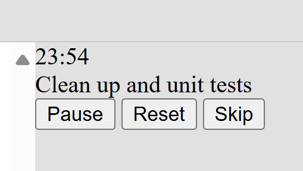
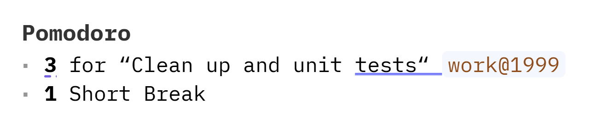

# SilverBullet Pomodoro Plug

> **note** Alpha Release   
> This is still very early and unfinished. Please report issues.

This plug adds support for using the [pomodoro technique](https://en.wikipedia.org/wiki/Pomodoro_Technique) in SilverBullet. 



Features:
- The standard work/short break/long break timers
- Pause/Reset/Skip buttons for the timer
- The ability to select a task from SilverBullet for tracking during that time
- It automatically saves your pomodoro iterations, so you can query them like other SilverBullet items!

## Installation

Use the `Plugs: Add` command and enter this: `github:mirdaki/silverbullet-pomodoro/pomodoro.plug.js`

## Usage

1. Open up the Pomodoro timer panel with the `🍅 Pomodoro: Toggle Panel` command (`Ctrl-Alt-z` by default)
2. Choose a task to work on with the `🍅 Pomodoro: Choose Task` command (`Ctrl-Alt-c` by default)
3. Click start and get working!
4. Stop when the work timer ends. Click the break timer then, blink, drink water, go for a walk, etc
5. Repeat. Get things done, give yourself grace, enjoy!

Query to see daily stats:
```query
item where "pomodoro" in itags and date = "2024-09-27" order by pomodoroType desc render [[Library/Personal/Query/Pomodoro Day]]
```

Template to display daily stats:
```
* {{#if pomodoroType = "work"}}**{{iteration}}** for “{{name}}“ {{#if taskRef}}[[{{taskRef}}]]{{/if}}{{/if}}{{#if pomodoroType = "shortBreak"}}**{{iteration}}** Short Break{{#if iteration > 1}}s{{/if}}{{/if}}{{#if pomodoroType = "longBreak"}}**{{iteration}}** Long Break{{#if iteration > 1}}s{{/if}}{{/if}}
```



### Configuration

This plug has some optional configuration that can be set in `SETTINGS`:
```yaml
pomodoro:
  # Determines where the panel is displayed:
  # - "lhs" - left hand side
  # - "rhs" - right hand side
  # - "bhs" - bottom
  # - "modal" - in a modal
  position: rhs

  # Must be > 0.
  # position = "lhs" | "rhs": determines the width of the panel.
  # position = "modal": sets the margin around the modal window.
  # position = "bhs": No effect
  size: .4

  # The query to use to get tasks listed by the `🍅 Pomodoro: Choose Task` command.
  taskQuery: task where done = false

  # The time in minutes for a work session.
  workTime: 25

  # The time in minutes for a short break.
  shortBreakTime: 5

  # The time in minutes for a long break.
  longBreakTime: 30

  # The number of work sessions before a long break.
  countForLongBreak: 4

  # The page to use to store pomodoro data.
  page: _POMODORO
```

## Acknowledgments

- [SilverBullet](https://silverbullet.md/), for being an awesome and hackable piece of software
- [SilverBullet TreeView plug](https://github.com/joekrill/silverbullet-treeview/), for being a good reference as this was built

## Development

See [CONTRIBUTING](./CONTRIBUTING.md)
